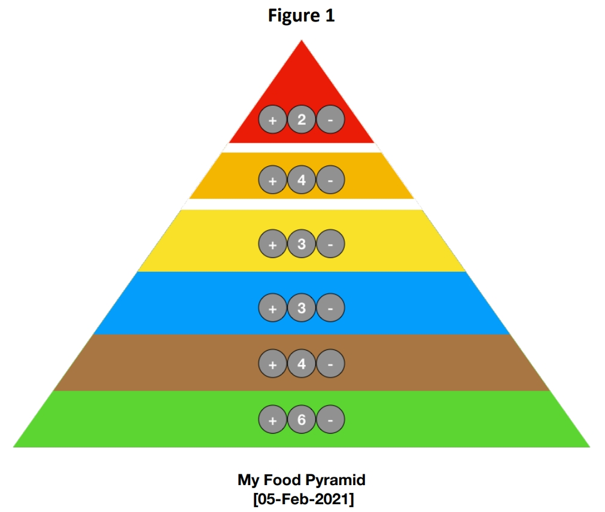

# An Interactive Food Pyramid

The Food Pyramid shows how much of what you eat overall should come from each shelf to achieve a healthy, balanced diet. The shape of the Food Pyramid shows the types of foods and drinks people need to eat most for healthy eating. It is divided into six shelves and each provides you with the range of nutrients and energy needed for good health. Healthy eating is all about choosing the right amounts from each shelf.

An interactive Food Pyramid allows you to record the number of foods consumed in any given day by categorising and recording the food types for each shelf.

## Functionality
Food pyramid have the following interactive functionality: 
1) Provide an indicator showing the number of items consumed for a particular shelf. It shows 6 items on the “Vegetables, salad and fruit” shelf (the bottom one). 
2) Include buttons (or similar devices) to increase and decrease the number of items on the shelf. The (+ / -) buttons (controls) should only appear when you hover over a particular shelf. 
3) The shelf numbers (6 for the lowest shelf) are always be displayed. 
4) Interactive method for inputting the date for the daily record.

## Note
Note the breaks between the shelf containing **“foods and drinks high in fat, sugar and salt” (red shelf)** and the shelf containing **“fats, spreads and oils” (orange colour)**. Similarly, there is a space separating the shelf containing **“fats, spreads and oils” (orange colour)** and **the other connected shelves**.

## Extra Functionality
1) Adjust the height of the individual Food Pyramid Shelves depending on the number of items on that shelf, 
2) Update the colour of the circle containing the number of items depending on whether the number is greater, within, or below the recommended guideline quantities， for both children ages 1-4, and for adults, teenagers and children aged 5 and over, for that shelf. 
3) The overall pyramid shape will preserved regardless of the height of the individual shelves. 
4) Provide a method to switch between the two different food pyramid recommendations. 

## Resources - The Food Pyramid

These online documents provide useful information about the Food Pyramid in an Irish context.

https://www.safefood.net/healthy-eating/the-food-pyramid-(1)/what-is-a-healthy-diet-(1)

https://www.safefood.net/healthy-eating/guidelines/children

https://irishheart.ie/wp-content/uploads/2018/01/IHF-Food-Diary-2018-A5-V3.pdf

## Resources - Making Pyramids with HTML/CSS

These online documents provide useful information about creating Food Pyramid components using HTML and CSS (use these for information – please do not directly copy and paste code as it may flag as a plagiarised submission).

https://www.creativebloq.com/css3/how-create-pyramid-layout-css-31619524

https://jsfiddle.net/augberto/Zb9nb/

https://codepen.io/nikolaygit/pen/wnchq

https://css-tricks.com/the-shapes-of-css/

## Deployment
This project will be running on: